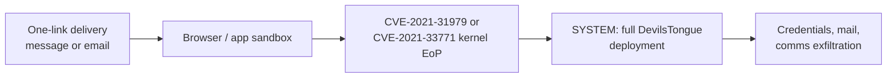

# Candiru / Sourgum

> The other profiles in this series are supply. Candiru is demand: a private-sector
> offensive actor that ships spyware to government clients and treats a Windows kernel
> elevation as a component to be procured, stocked and renewed. When Microsoft and Google
> exposed DevilsTongue in July 2021, the kernel piece was CVE-2021-31979 and
> CVE-2021-33771, two zero-days in one product cycle.

!!! note "Verdict basis"
    `cited`, as of 2026-10-02, to the July 2021 simultaneous publications: Microsoft MSTIC's
    "Protecting customers from a private-sector offensive actor using 0-day exploits and
    Devilstongue malware", Google TAG's companion analysis, and Citizen Lab's "Hooking
    Candiru". Victim profiles are Citizen Lab's; this page claims no attribution beyond the
    vendor names those reports establish.

## Who

Candiru is an Israeli surveillance vendor; Microsoft tracked the actor as Sourgum and the
spyware as DevilsTongue. The product is sold to government clients, and the clients' target
lists, reconstructed by Citizen Lab, are what distinguish this profile from every other page
in this section: journalists, activists and political dissidents, with victim concentration
in the Middle East and beyond, over a hundred confirmed infections in FortiGuard's follow-up
count.

Read against the series taxonomy: [Lazarus](lazarus-fudmodule.md) is a state building kernel
capability for its own operations. [Volodya](volodya-buggicorp.md) is a freelancer selling
to whoever pays. Candiru is the tier between and above both: a company whose product
*includes* kernel zero-days the way a car includes an engine, sold to states that never
touch the exploitation themselves. The kernel elevation was not the spying; it was the
skeleton key that let the spying run.

## The signature: kernel access as a line item

The July 2021 picture, across the three reports:

Two kernel elevation zero-days, CVE-2021-31979 (Windows kernel) and CVE-2021-33771
(win32k, the corpus's [most productive historic family](../case-studies/win32k-deep-dive.md)),
used to cross from a constrained execution context to SYSTEM, which is the deployment
requirement for the full spyware suite. Both patched in the same July 2021 Patch Tuesday
that accompanied the exposure. A later follow-on Chrome zero-day showed the inventory
renewing on schedule: a product line, not an incident.

The buyer never sees the exploit, and that is the design. Where Nightmare-Eclipse's
operators misspelled flags on their staged tools, a Candiru client clicks a panel. The
competence is concentrated at the vendor; the risk is distributed to the victim's machine.

## What it defeats, and what stops it

The July 2021 chain predates none of the Targets section's hardening story: the win32k bug
is the end of the line of a surface Microsoft spent a decade shrinking, which is why
procuring replacements became a standing cost of the business. What actually stopped this
chain was disclosure economics, not mitigations: vendor research (Microsoft, Google,
Citizen Lab) finding the exploit samples and victim infrastructure, then a coordinated
patch-and-publish. That is the recurring lesson of the spyware tier, and it is defensive:
the product dies by exposure faster than by hardening.

Against today's hardened targets the same procurement resumes elsewhere, which is the
argument the [bypass matrix](../bypasses/index.md) makes per defense: every dated verdict
is a price list entry for exactly this kind of buyer.

## Detection

Citizen Lab's route was infrastructure and victim-side, not endpoint telemetry, and that is
the honest answer for this tier: DevilsTongue's footprint on a host was small by design.
For defenders, the signals that worked were the delivery layer (one-link watering holes,
spoofed civil-society lures) and the market layer (broker and vendor watching), more than
the kernel exploit itself.

## Assessment

Candiru completes the market's shape in this series: individual sellers, state programs,
industrial tooling vendors, an anonymous contractor, and now the customer who assembles all
of it into a product whose targets are people rather than machines. The profile's lesson is
structural: kernel LPE zero-days are not exotic instruments, they are stocked inventory, and
the demand that keeps the shelves full comes from products like this one. Every detection
page in this corpus is, among other things, a response to that demand.

## Sources

Microsoft MSTIC, "Protecting customers from a private-sector offensive actor using 0-day
exploits and Devilstongue malware" (July 2021); Google TAG companion analysis; Citizen Lab,
"Hooking Candiru" (July 2021), for victims and infrastructure; FortiGuard Labs follow-up on
DevilsTongue infections; 2022 reporting on the follow-on Chrome zero-day.
