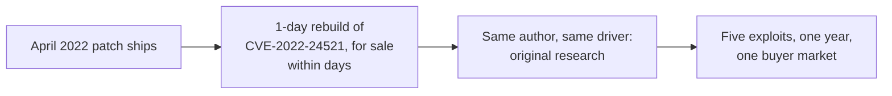

# The CLFS contractor

> In 2022 and 2023, ransomware crews needing SYSTEM kept returning to one driver, and
> Kaspersky's dissection of the exploits they used kept returning to one author. Five CLFS
> elevation-of-privilege exploits in roughly a year, linked by shared debug strings and code
> structure: a copyist who learned the driver by rebuilding a patched bug, then kept finding
> new bugs in it faster than Microsoft closed the old ones.

!!! note "Verdict basis"
    `cited`, as of 2026-10-02, to Kaspersky's Securelist series on the CLFS exploits used in
    ransomware attacks (Boris Larin, December 2023). The single-author finding is the
    researchers'; this page names no identity because the research names none. Exploits two
    and three of the series are cited by month, not CVE, matching the source.

## Who

Unknown, and that is part of the profile. What Kaspersky established is a body of work: five
elevated-privilege exploits against `clfs.sys`, the Common Log File System driver, used in
ransomware attacks across 2022 and into 2023, unified by code similarity and repeated debug
strings. This is [Volodya](volodya-buggicorp.md)'s trade a market cycle later: no forum
persona to catch, no advertisement, sales through the channels ransomware already uses.

| Exploit | Bug | Moment |
|---|---|---|
| #1 | CVE-2022-24521 | Written as a 1-day after the April 2022 patch; for sale on forums within days |
| #2, #3 | September, October 2022 | Original research in the same driver |
| #4 | CVE-2023-23376 | In the wild, February 2023 |
| #5 | CVE-2023-28252 | In the wild, April 2023 |

CVE-2022-24521 itself was an in-the-wild zero-day reported by the NSA and CrowdStrike
researchers; the contractor did not find it. The contractor rebuilt it the moment the patch
published, and Kaspersky's structural argument is that the rebuild was the education: the
author learned CLFS internals well enough while copying the fix to start finding original
bugs in the same code. The corpus carries the family end to end, from
[CVE-2022-24521](../case-studies/CVE-2022-24521.md) through
[CVE-2023-23376](../case-studies/CVE-2023-23376.md) and
[CVE-2023-28252](../case-studies/CVE-2023-28252.md), and the
[CLFS deep dive](../case-studies/clfs-deep-dive.md) maps why this driver keeps paying.

## The signature: the patch is the spec, then the driver is the quarry

The exploitation architecture, from the series' dissection of exploit #1, is a compact tour
of the corpus's primitive families: patch five values in a crafted BLF file so a
`CLFS_CLIENT_CONTEXT` overlaps a `CClfsContainer` pointer; abuse the overlap for an
arbitrary kernel QWORD decrement; convert that into
[PreviousMode](../primitives/exploitation/previous-mode-manipulation.md) manipulation plus
handle-table leaks for full kernel read/write; finish with
[token](../primitives/exploitation/token-swapping.md) theft to SYSTEM. Deterministic,
reliable, and never executing unsigned code.

## Why ransomware buys this, and why CLFS

A ransomware crew's economics differ from every other buyer on this site. Stealth is
worthless the moment encryption starts; reliability is everything, because a crashed box is
a lost extortion and a blue-screened fleet is a failed operation. The requirement is an LPE
that works at scale on unpatched machines, which selects for exactly what this author ships:
one driver known deeply, one primitive chain reused, weaponized against whatever the patch
has not yet reached.

The kernel elevation exists to kill or blind endpoint protection before encryption, the
same purpose [Lazarus's FudModule](lazarus-fudmodule.md) serves for espionage: kernel data
access to switch the sensors off. The buyer differs; the requirement does not.

## What it defeats, and what stops it

Nothing exotic, deliberately. The chain defeats the [vulnerable driver
blocklist](../mitigations/driver-blocklist.md) by not needing a third-party driver at all,
defeats [signature-based AV](../mitigations/index.md) by being a file the filesystem itself
parses, and asks nothing of mitigations like HVCI because it is data-only from start to
finish. What stops it is patching, which is why the author's catalogue has a half-life of
months: each sale burns the bug, each patch burns the exploit. That is the business model
working as designed; see [PlayBit](playbit-luxor2008.md) for the same economics a decade
smaller.

## Detection

A user-mode process writing `.blf` files into odd locations and then triggering log
operations on them is the family signature, and `clfs.sys` parsing attacker-supplied
containers is the choke point every case study in this family returns to. Blocklist
telemetry is useless here; there is no driver load. The strongest signal is the sequence:
container file creation, close, and elevation, in order, from one process.

## Assessment

The contractor is the industrial successor to the seller tier: anonymous, reliable, and
organized around one component known deeply rather than many known shallowly. The
career arc from 1-day copyist to original zero-day author inside a single driver, on a
deadline set by someone else's patches, is the purest expression this corpus has found of
patch economics driving exploitation. When the next CLFS-class bug lands in a ransomware
staging folder, the assumption this profile licenses is: same author, new bug, and the
clock started when the last patch shipped.

## Sources

Boris Larin, Kaspersky Securelist, the multi-part series on Windows CLFS exploits used in
ransomware attacks (December 2023): the single-author finding, the five-exploit catalogue,
and the exploit #1 architecture. NSA and CrowdStrike (Adam Podlosky, Amir Bazine) for the
original CVE-2022-24521 report.
