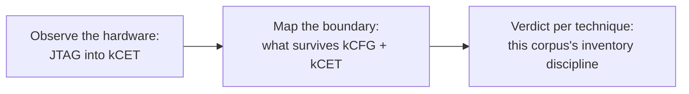

# Connor McGarr: the mitigation analyst

> Every other researcher in this series finds surfaces or builds catalogues. McGarr measures
> the defenses: what does a kernel shadow stack actually do at the moment of exploit, what
> does kCFG actually validate, and what is left when both work. His Black Hat 2025 talk is
> titled "Out Of Control", and it is about exactly who is out of control when control flow
> integrity lands.

!!! note "Verdict basis"
    `cited`, as of 2026-10-03, to his published record: the Black Hat USA 2025 presentation
    and its precursor research, all publicly available. He is a security researcher; this
    profile covers published research only.

## Who

A Windows exploit developer turned mitigation cartographer, @33y0re, whose trajectory this
corpus's readers can follow in order: the classic "Kernel Exploitation" series that taught
the [primitive](../primitives/index.md)-driven method to a generation, then the HVCI-era
pivot, "No Code Execution? No Problem!", and now the control-flow-destination work.

## The signature: test the mitigation, not the marketing

The 2025 arc is method, and the method is the profile:

1. **"Investigating Kernel Mode Shadow Stacks" (2025)**, driving a *JTAG hardware debugger*
   to observe kernel-mode CET enforcement in action. Not reading documentation, not
   inferring from crashes: physically watching the processor compare return addresses.
2. **"Out Of Control: How KCFG and KCET Redefine Control Flow Integrity in the Windows
   Kernel" (Black Hat USA 2025)**, the synthesis: which exploit techniques survive when
   indirect calls are validated and returns are shadow-checked.
3. **"No Code Execution? No Problem!"**, the earlier HVCI-era analysis: how to be dangerous
   with arbitrary kernel API calls and ROP under kCFG, rather than unsigned code.

That ladder is the [j00ru](j00ru-win32k-decade.md) method pointed the other way: instead of
enumerating attack surfaces, enumerate *defenses*, and measure each one's real boundary.
The corpus's Targets half is that enumeration's reference form, and pages like
[kCFG / kCET](../mitigations/kcfg-kcet.md) and [HVCI](../mitigations/vbs-hvci.md) exist to
carry exactly the verdicts his work puts numbers on.

## What the record says the mitigations actually do

The through-line of the HVCI-era and control-flow work, which this corpus's inventories
mirror verdict by verdict: code-execution-centered exploitation is closing, and what
survives is the data-only and legitimate-code-reuse tier, [token
swapping](../primitives/exploitation/token-swapping.md), PreviousMode tricks, dispatch
redirection through already-signed code. That is the same conclusion the
[DOG family](juan-sacco-dog.md) reached commercially and the [Lazarus](lazarus-fudmodule.md)
program reached operationally; McGarr's contribution is showing the mechanism, in hardware,
with reproducible method, which is what lets a reference like this one date and tier its
verdicts instead of gesturing at them.

## What it defeats, and what stops it

Research; the question is what it *arms*, and honestly, both sides: the exploitation series
is a curriculum, and the mitigation analyses are a curriculum for the defenders who have to
model what survives. The corpus's position on that duality is already stated on the j00ru
page: the map guides both, and publishing is still the winning trade.

## Assessment

The mitigation analyst is the profile this series needed to close its loop: surfaces are
found (j00ru, DEVCORE), catalogued (Forshaw, hfiref0x), priced (Volodya, Zerodium),
productized (Sacco, SpyBoy), bought (Candiru), used (Akira's crews), and *measured*
(McGarr). The measurement tier is where the corpus lives, which is why his talk titles read
like this site's section headings.

## Sources

Connor McGarr, "Out Of Control: How KCFG and KCET Redefine Control Flow Integrity in the
Windows Kernel" (Black Hat USA 2025); "Investigating Kernel Mode Shadow Stacks" (2025);
"No Code Execution? No Problem! Living in the Age of VBS, HVCI, and kCFG"; the Kernel
Exploitation series, all at connormcgarr.github.io.
