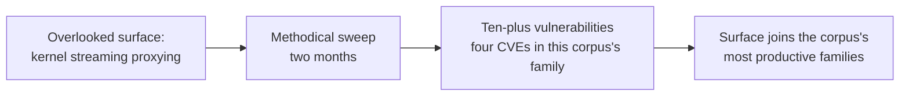

# DEVCORE: the subsystem hunters

> The [CLFS contractor](clfs-contractor.md) mines one driver because reliability sells.
> DEVCORE swept an entire overlooked subsystem, Windows kernel streaming, and reported more
> than ten vulnerabilities in two months, because nobody had looked. Three of them are
> already case studies in this corpus.

!!! note "Verdict basis"
    `cited`, as of 2026-10-03, to DEVCORE's published research, "Streaming Vulnerabilities
    from Windows Kernel" (2024), and to the MSRC records it covers.

## Who

The Taiwanese security research company, and the team whose 2024 kernel streaming series is
the modern benchmark for the subsystem sweep. Where the firm is best known for web and
infrastructure research, the streaming series is pure Windows kernel: the
[kernel streaming](../driver-types/kernel-streaming.md) surface, `ks.sys`, `mskssrv.sys`
and the proxying path into the kernel, mapped and mined methodically.

## The signature: find where nobody is looking, then look twice

The series' own framing is the finding: an *overlooked attack surface*, proxying user
requests through kernel streaming services, yielding ten-plus vulnerabilities in roughly
eight weeks. The corpus already carries the ground truth in its case studies:
[CVE-2024-30090](../case-studies/CVE-2024-30090.md) and
[CVE-2024-30084](../case-studies/CVE-2024-30084.md), with the series also covering
CVE-2024-30089 and CVE-2024-38144. The bug classes are the corpus's bread and butter,
use-after-free and memory corruption in dispatch paths, which is exactly what a surface
with IOCTL handling, asynchronous state and re-entrancy produces when it has never had a
[j00ru](j00ru-win32k-decade.md)-scale pass done on it.

## Why the sweep works, in this corpus's own numbers

Kernel streaming is one of the corpus's most productive families, fourteen case studies,
and the streaming series explains why in one line: the surface combines
[IOCTL handlers](../attack-surfaces/ioctl-handlers.md) with stateful asynchronous
teardown, which is the recipe for the [use-after-free](../vuln-classes/use-after-free.md)
family that dominates the corpus's [bug classes](../vuln-classes/index.md). A surface that
is complex, privileged, historically under-tested and reachable from low privilege is not
an accident of engineering; it is an unworked seam, and the sweep is how seams get worked.

Compare [j00ru](j00ru-win32k-decade.md)'s font campaign: same method, measure the surface,
fuzz at scale, report with reproducibility, a decade later and one subsystem over. Compare
also the [CLFS contractor](clfs-contractor.md): same surface-obsession, opposite purpose,
one of them publishes so the bugs die, the other sells so they do not.

## What it defeats, and what stops it

Nothing, deliberately: this is research that ships to the vendor. What it defeats is the
*obscurity* of the surface, which is a real defensive asset until it is spent. What stops
the bug flow is the same thing that thinned win32k after its decade: the sweep itself, plus
the patching that follows. Kernel streaming's era as an open seam is now closing the way
win32k's did, and the corpus's case studies are the sediment of both.

## Detection

Each case study in the family carries its own detection section; the family-level signal
for defenders is the shape, user-mode processes opening streaming service devices and
driving IOCTL sequences they have no legitimate reason to drive.

## Assessment

DEVCORE's series is the proof that the subsystem sweep remains the highest-yield method on
Windows, and that the seams are not exhausted, just unexamined. For this corpus, it is also
a benchmark for honesty about coverage: the streaming family's density exists because one
team looked, and the map of where nobody has looked is implicit in every family this site
catalogues sparsely.

## Sources

DEVCORE, "Streaming Vulnerabilities from Windows Kernel" (2024), the series covering
CVE-2024-30089, CVE-2024-30084, CVE-2024-38144 and the wider set; the corresponding MSRC
records; this corpus's kernel streaming case studies and deep-dive material.
