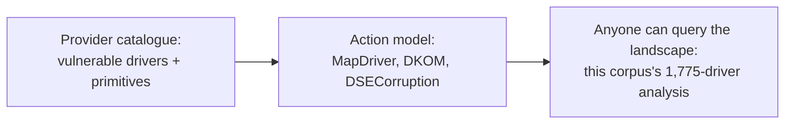

# hfiref0x: the tool smith

> Not every tool in this series is sold. KDU, the Kernel Driver Utility, is open source, and
> its provider model, pluggable vulnerable drivers, each declaring the kernel primitives it
> offers, became the de facto API for BYOVD. This site's own
> [KDU compatibility analysis](../reference/kdu-compatibility.md) measures the entire
> LOLDrivers catalogue against it.

!!! note "Verdict basis"
    `cited`, as of 2026-10-03, to the public KDU repository and releases, and to the corpus's
    own compatibility analysis of it. hfiref0x is a low-level Windows security researcher
    publishing under that handle; this profile covers the published tooling only.

## Who

The researcher behind a body of open-source Windows internals tooling, of which KDU is the
centerpiece: a framework that uses vulnerable signed drivers, *providers*, to perform kernel
actions from a legitimate administrative context. Where [Sacco](juan-sacco-dog.md) ships
capability as a commercial product and [SpyBoy](spyboy-terminator.md) ships it as a forum
retail SKU, hfiref0x ships it as source code, with documentation, under a license, on
GitHub.

## The signature: the provider abstraction

KDU's lasting contribution is not any single driver integration. It is the *model*: every
vulnerable driver is a provider that declares what it can do, and every kernel action is
expressed as a requirement against that menu. From this corpus's analysis:

| KDU action | Requires |
|---|---|
| MapDriver, load unsigned kernel code | Physical and virtual memory read/write |
| MapDriver, physical brute-force | Physical memory, PML4 brute-force |
| DKOM, kernel object manipulation | Virtual memory write |
| DSECorruption, patch `ci.dll!g_CiOptions` | The ability to reach that flag |

That table is why the model matters beyond the tool. It is a *taxonomy of the BYOVD
landscape*: once drivers are classified by the primitives they expose, the whole
[LOLDrivers](../reference/loldrivers-analysis.md) catalogue becomes queryable, which is
exactly what the corpus's 1,775-driver analysis does with it, finding 79 percent
KDU-compatible and 391 confirmed MapDriver-capable.

## What it defeats, and what stops it

KDU's actions are the classics of the pre-HLAT era: DSECorruption aims at
[signature enforcement](../mitigations/dse.md) through the `g_CiOptions` flag, a path the
[HLAT page](../mitigations/hlat.md) now records as closed on the hardware that supports it, and MapDriver
ends in unsigned kernel code, which [HVCI](../mitigations/vbs-hvci.md) exists to stop. The tool requires
administrative context by design; it is a demonstration that admin-to-kernel is one signed
vulnerable driver away, which is the argument the [blocklist](../mitigations/driver-blocklist.md) and this
corpus's entire Means half are built around.

## Assessment

The tool smith completes this series' industrial tier. KDU proves the observation that
matters for defenders: BYOVD is not a bag of one-off techniques but a *platform* with a
stable API, and any organization that models it incident by incident is modeling the wrong
unit. The corpus took the tool's own abstraction as the basis for measuring the entire
driver ecosystem, which is the highest compliment a reference can pay a tool: it was right
about the shape of the problem.

## Sources

The KDU repository and releases (hfiref0x, GitHub); this corpus's
[KDU Provider Compatibility Analysis](../reference/kdu-compatibility.md) and the LOLDrivers
deep analysis beneath it.
