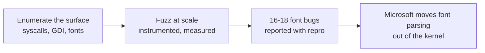

# j00ru: the win32k decade

> Every other profile in this series is supply or demand. Mateusz Jurczyk, j00ru, is the map
> maker: the researcher who spent a decade enumerating the win32k attack surface until it
> could no longer be ignored, first by attackers, then by Microsoft. The corpus's
> [win32k family](../case-studies/win32k-deep-dive.md) is, in large part, a catalogue of
> ground he surveyed first.

!!! note "Verdict basis"
    `cited`, as of 2026-10-02, to his published record: the j00ru//vx blog and its GDI and
    win32k syscall research, and the Google Project Zero font-fuzzing series. No CVE-level
    attribution is claimed beyond what those sources state.

## Who

A Windows kernel security researcher, publishing as j00ru since 2009, later of Google Project
Zero, and co-author (with Gynvael Coldwind) of the training and writing that defined how a
generation learned [kernel exploitation](../case-studies/win32k-deep-dive.md). The relevant
body of work is not a set of exploits. It is enumeration: syscall tables catalogued, GDI
object surfaces mapped, and the font-parsing path fuzzed at scale until it gave up its bugs
on a schedule.

## The signature: treat the surface as the unit of work

Where Volodya's unit of work was an exploit and the CLFS contractor's was a driver, j00ru's
was the *attack surface*: whole subsystems, measured.

The flagship is the 2016 series "A year of Windows kernel font fuzzing": sustained,
instrumented fuzzing of Windows' handling of TrueType and OpenType fonts across `win32k.sys`
and `ATMFD.DLL`, yielding sixteen reported vulnerabilities, with an eventual count of
eighteen. The posts are as notable for method as for count: coverage statistics, harness
design, crash triage throughput. This is finding expressed as engineering, and it set the
template that security labs now run on every driver family this corpus tracks.

## What the record did to the ecosystem

The finding had a defensive consequence, which is the profile's point. After years of
kernel-mode font bugs, Microsoft moved font parsing toward user-mode isolation in Windows 10,
shrinking the [win32k](../driver-types/win32k.md) surface rather than patching it bug by bug.
That is the rarest outcome in this corpus: a researcher whose work changed the size of the
attack surface itself, not just its bug count. Compare the [DOG profile](juan-sacco-dog.md)'s
targets: hijacking dispatch tables that sit in kernel memory, a class of technique that only
exists because of how much *is* in kernel memory; every subsystem that leaves kernel mode on
account of work like this takes a family of techniques with it.

For the attacking side, the same enumeration was a shopping list. The win32k UAF and race
family that [Volodya](volodya-buggicorp.md) sold and APTs bought throughout the 2010s lived
on ground that researchers had mapped publicly years before. That is the finder's paradox
this profile records rather than resolves: the same map protects the border and guides the
invaders, and which effect dominates depends on who reads it faster.

## Detection

Not this profile's lesson; the finder's detection story *is* the corpus. Fuzzing-derived
fixes ship as the patches the [case studies](../case-studies/index.md) dissect, and the
harnesses he published became the ancestors of the tooling the [fuzzing
page](../tooling/fuzzing.md) documents.

## Assessment

The series needed its mirror: everyone else here thinks in bugs, chains, products or
purchases. j00ru thinks in *surfaces*, and the field's center of gravity moved toward that
way of thinking, on both sides, in his wake. A defensive reader gets the most from this
profile: it is the closest look this section offers at how the corpus itself comes to know
things.

## Sources

j00ru//vx (j00ru.vexillium.org), the syscall and GDI research archive; Mateusz Jurczyk,
Google Project Zero, "A year of Windows kernel font fuzzing" parts 1-2 (2016); the
co-authored kernel exploitation training material.
