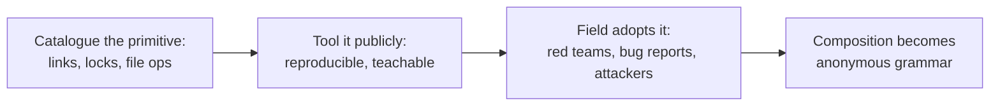

# James Forshaw: the primitives librarian

> The corpus has a shelf of Windows exploitation primitives, and most of them have the same
> original author. James Forshaw, tiraniddo, spent years turning file-system and object-manager
> abuse into a documented, reusable vocabulary: NTFS junctions, NT symlinks, hard links,
> oplocks, privileged file operations, UAC's actual boundary. Attackers compose his catalogue
> so routinely that the composition has stopped being an homage; it is just how the grammar
> works.

!!! note "Verdict basis"
    `cited`, as of 2026-10-02, to his public record: the Project Zero and conference
    material on symbolic-link abuse and UAC, the TROOPERS and ZDI work that propagates it,
    and the 2026 Project Zero post on Administrator Protection. He is a defensive researcher
    at Google; this profile covers published research only.

## Who

A Windows security researcher whose career spans Context, NCC Group, Google Project Zero,
and a long run of the field's most-cited Windows internals work. The relevant artifact is not
an exploit or a campaign. It is a *catalogue*: the systematic description of how Windows'
link mechanisms, locking primitives, and privileged file operations can be combined to make
a higher-privileged process act on attacker-chosen targets.

## The signature: name the primitive, and it becomes reusable

The catalogue's core moves, each of which he documented and tooled:

- **NTFS junctions and object-manager symlinks** as redirection: the privileged process
  opens what it thinks is its own path and acts on yours.
- **Opportunistic locks** as a pause button: freeze the privileged operation at the exact
  instant between its check and its use.
- **Arbitrary file and directory operations** (delete, move, create) as escalation
  primitives in their own right, not as side effects.
- **UAC's boundary described honestly**, as an integrity boundary with holes rather than a
  security boundary, in the ZeroNights work that still anchors the field's understanding.

Read that list next to the [Nightmare-Eclipse profile](nightmare-eclipse.md). His chain
skeleton, coerce a SYSTEM service, redirect where it acts, win or pause the
check-to-use window, is this catalogue composed in order: junctions, symlinks, oplocks,
[TOCTOU](../vuln-classes/toctou-double-fetch.md), [logic bugs](../vuln-classes/logic-bugs.md).
Eclipse changed the coercion and the payload; the middle of the chain is library code. The
same is true of a decade of UAC bypass writeups, enterprise privilege-escalation playbooks,
and the ZDI escalation-techniques series that openly propagates the framework.

That is the librarian's effect: work this well documented stops being attributed. Nobody
writes "a Forshaw-style junction redirect" any more than they footnote dictionary spellings.

## The second act: auditing the replacement

The record has a current chapter worth noting. Windows' new Administrator Protection, the
boundary intended to replace UAC's weakest assumptions, shipped into the hands of a research
community trained by this same catalogue, and Forshaw's recent Project Zero work reads it
the way he read UAC: boundary first, holes second, a 2026 post on bypassing it via UI Access
abuse, with nine related vulnerabilities fixed in the same window. The librarian is now
stocking the shelf the defenders shop from, and finding it holds fewer excuses than the old
one.

## What it defeats, and what stops it

The catalogue's techniques defeat the boundary they target by *using it correctly*: the
privileged process performs its own operations, on paths the object manager resolves in the
attacker's favor. Nothing is corrupted, no memory is touched, which is why these chains walk
past exploit mitigations entirely and land as [logic bugs](../vuln-classes/logic-bugs.md).
What stops them is the fix class the corpus documents: refuse or constrain reparse points
in privileged paths, operate on handles rather than re-resolved names, and design consent
boundaries, the Administrator Protection lesson, that do not depend on the file system being
polite.

## Assessment

Forshaw is this series' proof that the most-imited developers are not always attackers. The
exploit economy runs on a vocabulary of primitives, and a large fraction of that vocabulary
was described, named, tooled and published by one defensive researcher, whose work attackers
now use anonymously and whose current work audits the boundaries built in response. Every
[filesystem surface](../attack-surfaces/filesystem-irps.md) case study in this corpus is, a
few layers down, written in his notation.

## Sources

James Forshaw, "A Link to the Past: Abusing Symbolic Links on Windows" (SyScan) and the
Project Zero Windows symbolic-link mitigation work; "Bypassing UAC" (ZeroNights); the
TROOPERS "Abusing Privileged File Operations" propagation; ZDI's escalation-techniques
series; Project Zero (2026), "Bypassing Administrator Protection by Abusing UI Access".
