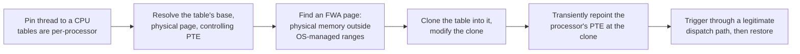

# Juan Sacco / Exploit Pack: DOG

> A commercial offensive-tooling vendor whose 2026 research series takes one mechanism,
> clone-and-repoint, and applies it to every kernel dispatch table in turn: SSDT, Shadow SSDT,
> IDT, GDT. The bugs do not matter. The insight does: if kernel code execution is closed, stop
> asking for it, and redirect dispatch instead.

!!! note "Verdict basis"
    `cited`, as of 2026-10-02, to the vendor's own series on exploitpack.com and the EuskalHack
    2026 talk. This is product-adjacent research from a company that sells the tooling, which
    raises the incentive to present capabilities favorably; the technical detail is specific and
    internally coherent, and every capability claim below traces to their posts. The HLAT
    closure in *What stops it* is `inferred`: it follows from the mechanism, and no post in the
    series addresses it.

## Who

Juan Sacco is the researcher behind Exploit Pack, a commercial offensive security platform (EP3),
and DOG, its Data Only Gadgets tooling. Where [Nightmare-Eclipse](nightmare-eclipse.md) drops
zero-days over a disclosure grudge and [Lazarus](lazarus-fudmodule.md) runs a state program,
Sacco's series is the third kind of actor this section exists for: the industrialist. The DOG
posts are not incident reports. They are capability engineering, published as research, one
kernel table at a time.

The series, all under the vendor's blog:

| Post | Table | Target |
|---|---|---|
| SSDT hijack under HVCI | Native dispatch | `ntdll.dll` system service dispatch |
| Shadow SSDT hijack | GUI dispatch | `win32u.dll` to `win32k*` dispatch |
| IDT hijacking under VBS/HVCI/kCET | Interrupt dispatch | `INT 0x2E` into `nt!KiSystemService` |
| GDT hijacking and FWA | Segment descriptors | An installed IA-32e call gate |

Plus the DOG overview (a capability list) and an EuskalHack 2026 talk tying the family together.

## The signature: one mechanism, four tables

The interesting object is not any single post. It is that the same six-step skeleton appears in
all of them, because the constraint that produces it is the same everywhere:

The original page is never written. Every mutation happens in a
[Free Writable Area](../primitives/exploitation/fwa.md), a physical page in the gaps outside
OS-managed RAM ranges, reachable through a physical memory primitive and validated by writing a
pattern, reading it back, and restoring. The processor is shown the modified clone only for the
duration of one trigger, then pointed back.

Read against KernelSight's model, the whole series is a sustained answer to one defense: HVCI
closes unsigned kernel code execution, so DOG stops trying to execute code at all. Every
technique is data-only. The payload is not injected instructions; it is a redirected dispatch
entry pointing at a function that already exists, signed, in `ntoskrnl.exe` or `win32k`.

Per-table specifics worth keeping:

- **Shadow SSDT** achieves token swap to SYSTEM on Windows 11 with VBS, HVCI, and kCET enabled,
  dispatching through `KeServiceDescriptorTableShadow`, which is undocumented and GUI-only
  (`win32u.dll`, not `ntdll.dll`).
- **IDT** triggers `INT 0x2E` into `nt!KiSystemService` through a redirected
  `NtSetQuotaInformationFile` slot. The post honestly notes the tell: almost nothing uses
  `INT 0x2E` anymore, so a handler offset outside the `ntoskrnl.exe` range is conspicuous.
- **GDT** installs a user-callable IA-32e call-gate descriptor, 16 bytes in long mode and
  therefore spanning two slots, staged at selector `0x0058` with the clone's limit expanded to
  `0x007f`, and entered through an existing WOW64 transition path.

## What it requires, and what the toolkit ships

Every technique in the family assumes a **physical memory read/write primitive** to reach and
validate FWA pages. That is a higher bar than a logical kernel R/W, and it is why the toolkit's
BYOVD-heavy feature list matters as context: controlled virtual and physical read/write, PPL
modification, LSASS `PatchWDigest`, LSASS raw-page and minidump extraction with PPL zeroing,
suspend of protected processes, callback zeroing, PID unlink. The dispatch-table research is the
top of a stack whose bottom is the same class of signed vulnerable driver this corpus documents
end to end.

## What it defeats, and what stops it

**Walks past:** HVCI, kCFG and kCET, by construction. A data-only dispatch redirection never
generates unsigned code and never returns through a corrupted stack, so the code-integrity
family is aimed past the technique entirely. On the hardware the series targets, this is the
cleanest demonstration in the corpus of *code execution being the wrong goal*.

**Should stop it, one feature, four rows:** every technique in the family repoints a guest PTE.
HLAT makes the processor walk hypervisor-owned page tables, so repointing the guest PTE should
not change translation at all: one hardware feature closing the entire family at once. That is
`basis: inferred`. No post in the series mentions HLAT, HVPT, or VT-rp, and the IDT title claims
"under VBS, HVCI, kCET" without testing the one thing that would falsify the mechanism. If the
inference holds, it is the clearest single-cause, multi-row closure the
[bypass matrix](../bypasses/index.md) could display, and it is exactly why the matrix exists.

**Recorded tension, not resolved:** the DOG overview's mitigation table claims PatchGuard is
uninvolved because "gadgets target non-protected data." The IDT and GDT are precisely the
structures PatchGuard has historically monitored. Either the transient remap-and-restore window
evades the periodic check, which would be genuinely interesting, or the claim is too broad. No
post in the series argues it, so this page does not either.

## Detection

- **FWA validation behavior** is the earliest and loudest signal: pattern writes into physical
  memory outside OS-managed ranges, read back and restored, preceded by the enumeration that
  found the gaps.
- **Transient PTE flips** on pages backing the IDT, GDT, or service tables: short-lived, but
  page-table telemetry that samples per-CPU mappings can catch them.
- **Structural artifacts** that outlive the trigger: a GDT call gate at `0x0058`, a service slot
  resolving outside `ntoskrnl.exe`, any `INT 0x2E` traffic on a modern system.

## Assessment

The DOG series is the industrial tier of this section's thesis. Nightmare-Eclipse composes old
primitives at speed; Lazarus industrializes one road to kernel data; Sacco industrializes what
happens *after* the primitive exists, systematically, against the newest defenses, with a
mechanism designed to be reusable across every table Windows dispatches through. The family also
hands the corpus two of its cleanest testable predictions: HLAT closes all four techniques for
one reason, and PatchGuard either does or does not tolerate the transient window. Both are
recorded here as open, and both belong in the matrix the day someone tests them.

## Sources

Juan Sacco / Exploit Pack: the SSDT, Shadow SSDT, IDT, and GDT hijacking posts and the DOG
overview under `/blogs/news/` on exploitpack.com; the EuskalHack 2026 talk announcement.
Provenance: vendor research content, weighted accordingly throughout.
