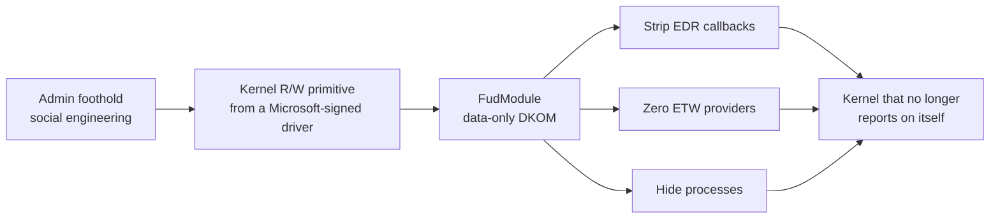
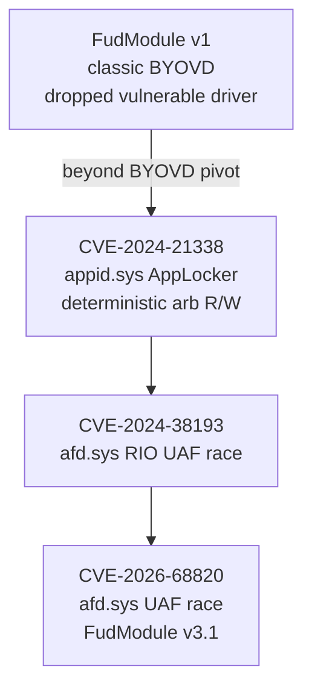

# Lazarus / FudModule

> A DPRK-nexus actor whose exploitation is the opposite of a coercion chain: get a kernel read/write primitive out of a driver Windows already ships, then spend it on nothing but data-only kernel object manipulation to switch the defenses off.

!!! danger "Exploited in the Wild"
    Every chain on this page ran as a zero-day in a real campaign (Operation Dream Job) before its
    patch. This is the most operationally proven body of work in the corpus.

!!! note "Verdict basis"
    `cited` for attribution and campaign detail (Gen Digital / Avast, Microsoft servicing notes,
    Check Point Research); `reversed` for the individual bugs, which have full
    [case studies](../case-studies/index.md) in this corpus. Where a claim rests on a single
    vendor's report it is marked.

## Who

Lazarus Group is a DPRK state-nexus actor. The relevant slice of their work here is a multi-year
effort to run **FudModule**, a kernel rootkit, on up-to-date Windows. The delivery vehicle is
Operation Dream Job: fake job offers aimed at defense, aerospace, aviation, drone, robotics and
military-technology organizations. Social engineering gets the foothold; everything on this page is
what happens after, on the way from that foothold to a kernel that no longer reports on itself.

This actor belongs in Notable Exploits as the deliberate counterweight to
[Nightmare-Eclipse](nightmare-eclipse.md). Eclipse reaches SYSTEM by coercing a privileged
user-mode service and rarely touches kernel memory. Lazarus does the reverse: it goes straight for
a kernel read/write primitive and reaches a trust level *above* SYSTEM, then uses it to disable the
monitoring that SYSTEM alone cannot touch. Two developers, two roads, and between them they bracket
what "the way up" means.

## The signature: admin-to-kernel, then data-only DKOM

The house style has two fixed halves.

**Half one: get kernel R/W from a driver that is already trusted to load.** The insight Lazarus
industrialized is that you do not need to *bring* a vulnerable driver (classic
[BYOVD](../reference/byovd.md)) if a driver Windows already ships has an exploitable primitive. Gen
Digital named this "beyond BYOVD" when they caught [CVE-2024-21338](../case-studies/CVE-2024-21338.md):
Lazarus targeted `appid.sys`, the AppLocker kernel component, which loads by default on every
modern Windows install. No dropped driver, no blocklist entry to trip, no anomalous load event.

**Half two: spend the primitive only on kernel data, never code.** FudModule is a **data-only
DKOM** rootkit. With arbitrary kernel read/write it does not inject code (which would trip code
integrity). It edits kernel *data structures*:

- Unregisters the callbacks EDR depends on: `PsSetCreateProcessNotifyRoutine`,
  `ObRegisterCallbacks`, and image-load notifications.
- Zeros ETW provider registrations so telemetry stops at the source.
- Hides processes by unlinking them from the active process list.
- Rewrites token fields for privilege where needed (see
  [token swapping](../primitives/exploitation/token-swapping.md)).

The whole point of the corpus, that [a kernel primitive is spent against user-layer
defenses](../bypasses/index.md), is this actor's entire operating model stated as a design goal.

## The chain, generation by generation

The bugs change; the two-half skeleton does not. What evolves is the driver choice, and the
direction of travel is instructive: away from dropped third-party drivers, toward drivers Windows
ships and cannot remove.

| Generation | Driver | Bug shape | Why this driver |
|------------|--------|-----------|-----------------|
| v1 (BYOVD) | dropped third-party | brought its own arb R/W | Works, but the driver drop and load are detectable and blocklistable |
| [CVE-2024-21338](../case-studies/CVE-2024-21338.md) | `appid.sys` (AppLocker) | IOCTL `0x22A018`, `METHOD_NEITHER`, unprobed pointer, no access check | Ships and loads by default. **Deterministic**: no race, no leak, no grooming |
| [CVE-2024-38193](../case-studies/CVE-2024-38193.md) | `afd.sys` | Registered I/O deregister [use-after-free](../vuln-classes/use-after-free.md) race, reclaimed by pool spray | Reachable from any privilege, cannot be removed (networking) |
| [CVE-2026-68820](../case-studies/CVE-2026-68820.md) | `afd.sys` | unsynchronized socket-state UAF race, kernel R/W, FudModule v3.1 | Same reasoning as above, five weeks as a zero-day |

The pivot from v1 to v2 is the whole story. Once you accept that a Windows-shipped driver will do,
the [AFD deep dive](../case-studies/afd-deep-dive.md) explains why `afd.sys` in particular keeps
supplying the primitive: it is the third most productive component in this corpus, reachable from
any privilege level, and impossible to uninstall because sockets stop working without it.

## What it defeats, and what stops it

**Defeats an entire category of driver defense.** The vulnerable-driver blocklist, HVCI's signing
policy, and driver-load telemetry all answer one question: "should this driver be allowed to load".
For `appid.sys` and `afd.sys` the answer is yes on every Windows machine. No blocklist entry is
possible, no load event is anomalous, no signature check fails. This is precisely the gap the
"beyond BYOVD" pivot was built to exploit, and it is why load-time defenses are the wrong layer to
catch this actor.

**Defeats EDR after the fact, from below.** Once FudModule strips the callbacks and zeros ETW, the
product is not bypassed so much as blinded: it keeps running and reports nothing, because the kernel
data it reads its own truth from has been edited underneath it.

**What actually constrains it:**

- **HVCI / VBS and kernel CFG** raise the cost of converting the primitive into execution, though a
  data-only rootkit is designed to need no code execution at all, which is the point.
- **Least privilege on the foothold.** These are admin-to-kernel chains: they assume an admin
  token as the starting line. Denying local admin denies the start.
- **Detecting the effect, not the load.** Because the load is invisible, the surviving signal is
  behavioral and after-the-fact: kernel callbacks and ETW providers going silent, an EDR agent
  whose kernel-notification registrations vanish. See [Detection](#detection).

## Detection

!!! warning "This is the hard case"
    A data-only DKOM rootkit injects no code and drops no driver of its own. There is no image to
    YARA-scan for the rootkit itself, and the vulnerable driver it rides is a legitimate signed
    Microsoft binary. Detection has to move to the anomalous *use* and the *effect*.

- **Anomalous IOCTL traffic to a security driver's device.** For CVE-2024-21338, control code
  `0x22A018` to `\Device\AppId` from a process that is not the AppLocker service is the tell. The
  per-CVE case study ships the YARA rule for the vulnerable `appid.sys` build and the ETW angle.
- **Callback and ETW registrations disappearing.** An EDR that watches its own kernel notification
  registrations can notice when they are unhooked. Registrations going from present to absent
  without a driver unload is a strong signal of DKOM.
- **The foothold, not the escalation.** Operation Dream Job's initial access is social engineering
  against a known target set. The cheapest place to break the chain is before the admin token
  exists, which is upstream of everything on this page.

## Lazarus versus Nightmare-Eclipse

The two profiles in this section are near-perfect opposites, and reading them together is the point.

| | Nightmare-Eclipse | Lazarus / FudModule |
|---|---|---|
| Road to power | Coerce a privileged **user-mode** service | Kernel **read/write** from a signed driver |
| Bug novelty | Old primitives, novel **composition** | The **bug is the point**; deployment is fixed |
| Driver involvement | Mostly none (cldflt is the exception) | Central: `appid.sys`, `afd.sys` |
| Destination | SYSTEM | Above SYSTEM: kernel, then blind the defenses |
| Defeats | Signature AV, patch assurance | The whole "should this driver load" category, plus EDR from below |
| Stopped by | Application allowlisting | Least privilege on the foothold; effect-based detection |
| Proof | One live intrusion, escalations failed | Repeated successful zero-day campaigns |

## Sources

Gen Digital / Avast, "Lazarus and the FudModule rootkit / beyond BYOVD" (CVE-2024-21338) ·
Microsoft servicing notes and Check Point Research (CVE-2024-38193, CVE-2026-68820) · the per-CVE
[case studies](../case-studies/index.md) in this corpus for the reversed internals.
