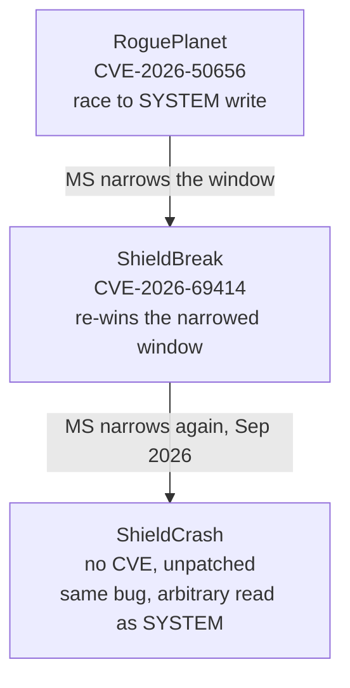

# Nightmare-Eclipse

> Roughly fourteen Windows LPE exploits in six months, almost all reaching SYSTEM by coercing a security product rather than corrupting kernel memory. The bugs vary; the chain does not.

!!! note "Verdict basis"
    `cited`, as of 2026-09-22. Built from public vendor and press analysis (Huntress, Barracuda,
    Picus, ThreatLocker, LevelBlue SpiderLabs, SecurityWeek, BleepingComputer, The Register), not
    from independent reversing of the exploit binaries. Claims that rest only on the developer's own
    statements are marked. Nothing here is a repro attestation. Several of these are unpatched or
    exploited in the wild, so this page stays at the level of mechanism and chain, not weaponized
    detail.

## Who

A single developer using the aliases **Nightmare-Eclipse**, **Chaotic Eclipse** and **Dead Eclipse**; real identity unknown. From 3 April 2026 through at least early September 2026 they publicly dropped on the order of fourteen zero-day exploits, a cadence near one every eleven days, framed as retaliation over a bug-bounty and disclosure dispute with Microsoft. Microsoft has been removing the GitHub repositories as they appear.

The releases are not academic. Huntress documented a hands-on-keyboard intrusion (April 2026) in which an operator staged three of the tools (BlueHammer, RedSun, UnDefend) after a FortiGate SSL-VPN credential compromise. Notably none of the escalations succeeded in that incident, and the operator misspelled tool flags, which says the person deploying the tools was not the person who wrote them. That gap matters defensively and is picked up in [Detection](#detection).

## The signature: composition, not novel bugs

The interesting thing about this body of work is not any single vulnerability. Most of the underlying tricks are old: NTFS junction redirection is twenty years old, oplocks as a race primitive are a Forshaw staple, coercing an antivirus into a privileged file operation is a known genre. What is distinctive is the **composition**: the same five-stage skeleton applied to one privileged component after another, changing only the coercion and the redirect while the rest stays fixed.

Stated as a template, every marquee chain is:

Read against KernelSight's pipeline, stages A and B are the [logic bug](../vuln-classes/logic-bugs.md) and its [TOCTOU](../vuln-classes/toctou-double-fetch.md) window, stage D is a SYSTEM-context trigger, and stage E is the same [token](../primitives/exploitation/token-swapping.md)-and-session move that a kernel primitive is usually spent to reach. The chain arrives at SYSTEM by a user-mode road, but it arrives at the same place, so [what that access buys against user-layer defenses](../bypasses/index.md) applies unchanged.

The reused primitive vocabulary:

- **Coercion:** EICAR-in-source to induce a Defender scan; Cloud Files placeholder association to make a file look "cloud-tagged" and trigger restore; a suspicious Office macro to trigger EDR macro-removal.
- **Redirect:** `IO_REPARSE_TAG_MOUNT_POINT` junctions on a user-owned staging directory; NT object-manager symlinks; per-session DOS-device namespace redirection.
- **Timing:** `FSCTL_REQUEST_BATCH_OPLOCK` to pause the SYSTEM operation at a known point, or a tight `FILE_SUPERSEDE` race, synchronized off a VSS snapshot appearing.
- **Load:** COM local-server activation of a `RunAs = LocalSystem` class whose image path the chain now controls.
- **Bridge:** `GetNamedPipeServerSessionId` plus `SetTokenInformation(TokenSessionId)` to bounce the SYSTEM process back into the user's desktop as an interactive shell.

Once you have seen the skeleton, each new drop reads as "which component did he point it at this time".

## The marquee chain: one boundary, three patches, three bypasses

The clearest demonstration of the developer's method is not a single exploit but a lineage. Three consecutive drops target the **same** boundary in Microsoft Defender's remediation path (`MsMpEng.exe`, the Antimalware Service Executable, running as SYSTEM), and each defeats Microsoft's fix for the previous one.

The boundary is the classic [TOCTOU](../vuln-classes/toctou-double-fetch.md): Defender's remediation resolves a path a low-privileged user staged, follows a reparse point the user plants between the engine's check and its use, and performs a SYSTEM file operation at the redirected target. Microsoft patched it three times by tightening the check rather than removing the reparse-follow, so each fix only shrank the race window. ShieldBreak re-measures and re-wins the shrunk window. ShieldCrash does it again after the September 2026 rollup ("under specific conditions it is still possible to trigger the exact same problem").

Two lessons from the lineage:

- **Narrowing a race window is not closing it.** As long as the privileged operation still follows a user-controlled reparse, the class survives. An [oplock](../attack-surfaces/shared-memory.md) that pauses the SYSTEM side makes the narrowed timing irrelevant. The durable fix is to refuse reparse points or work against a canonicalised, re-validated handle.
- **When the write half is closed, the read half often survives.** ShieldCrash's surviving primitive is **arbitrary file read as SYSTEM**: read the `SAM` and `SYSTEM` hives, extract hashes offline. That is credential theft rather than direct code-exec, and it is still a serious primitive. The developer shipped it as an admitted "skeleton PoC" and left the write-to-exec upgrade unfinished.

## The catalogue as chains

Grouped by the primitive that carries them, not by date. Links go to KernelSight pages where a chain touches a component already in the corpus.

### Defender remediation coercion

| Exploit | CVE | Chain in one line |
|---------|-----|-------------------|
| **BlueHammer** | CVE-2026-33825 | WinDefend RPC plus AV-induced VSS plus transacted SAM read plus SAM-hash swap; SAM theft to SYSTEM |
| **RedSun** | none | EICAR trigger, Cloud Files placeholder to earn a restore, oplock pause, junction redirect to `System32\TieringEngineService.exe`, COM load as SYSTEM |
| **UnDefend** | none | Not an escalation: locks Defender signature files to degrade detection silently. The blinding half of a chain, deployed alongside the escalation |
| **RoguePlanet / ShieldBreak / ShieldCrash** | CVE-2026-50656 / CVE-2026-69414 / none | The lineage above: one reparse-follow TOCTOU, patched and re-won twice |

### Cloud Filter driver (`cldflt.sys`)

| Exploit | CVE | Chain in one line |
|---------|-----|-------------------|
| **MiniPlasma** | CVE-2020-17103 | Re-exploitation of Forshaw's 2020 Cloud Filter bug via `CfAbortHydration`; registry write into the `.DEFAULT` hive without an access check, to SYSTEM. Works on fully patched Windows 11 and Server 2022/2025 |
| **GreenPlasma** | none | No-race variant of the cldflt write: an HKCU self-symlink removes the timing entirely |

`cldflt.sys` is a live surface in the corpus: see [CVE-2026-20857](../case-studies/CVE-2026-20857.md) and [CVE-2025-62454](../case-studies/CVE-2025-62454.md) among the [Cloud Filter case studies](../case-studies/index.md), and the driver's role as a [file-system minifilter](../driver-types/third-party-security.md) more broadly. MiniPlasma is the campaign's cleanest kernel-driver link.

### Third-party security products

The developer generalized the "privileged security feature equals LPE surface" thesis well beyond Microsoft.

| Exploit | Product | Chain in one line |
|---------|---------|-------------------|
| **FalconFlank** | CrowdStrike Falcon | Abuses the Office suspicious-macro-removal feature: coerced privileged file rewrite, RedSun shape on an EDR. Vendor mitigation: disable the macro-removal policy |
| **HardBreacher** | Kaspersky | Per-session DOS-device namespace redirect of the vendor's own install path into a process its self-protection driver trusts by path |
| **PrettyPrague** | Avast (also AVG, Norton) | Coerce the AV sandbox/emulation helper into reading an arbitrary file instead of the sample; spawns a full-SYSTEM shell |
| **GreenSection** | NVIDIA display driver | Improper access control on an Everyone-writable named section shared across the vendor's user-mode components; stale-data reuse yields an out-of-bounds write. A genuine kernel-driver bug: see [shared memory as an attack surface](../attack-surfaces/shared-memory.md) |

### Boot / physical access

| Exploit | Product | Chain in one line |
|---------|---------|-------------------|
| **YellowKey** | BitLocker | Targets TPM-only configurations; physical-access data disclosure. Mitigation is configuration: TPM plus PIN |
| **GreatXML** | WinRE | Plant `unattend.xml` on the unencrypted recovery partition, Shift-reboot into WinRE for an unrestricted shell against a BitLocker volume |

## What it defeats, and what stops it

KernelSight grades an escalation by which defenses it walks past. This body of work is unusual because the thing it abuses is the defense.

**Walks past:**

- **Signature and behavioral AV, by turning the AV into the primitive.** The escalation runs *through* Defender or the EDR, so the product cannot flag its own privileged action as malicious.
- **Patch-level assurance, repeatedly.** MiniPlasma runs on a fully patched Windows 11; the ShieldCrash lineage runs on the September 2026 rollup. "Fully patched" is not a defense against an incomplete-fix re-probe.

**Stops it cold:**

- **Application allowlisting (WDAC / AppLocker, enforced).** The single highest-leverage control here. It blocks the dropped exploit binary from executing at all, so no coercion ever runs, regardless of patch state. This defeats even the unpatched drops. See [App Control for Business](../mitigations/app-control-for-business.md).
- **Defender Tamper Protection**, which directly blunts UnDefend and the quarantine-manipulation coercions.
- **Least privilege.** Every chain needs an existing standard-user foothold. This is "the way up", never "the way in". No foothold, no escalation.

## Detection

Ordered by fidelity. The first is close to a zero-false-positive signature.

!!! tip "Highest-fidelity signal"
    A SYSTEM-integrity shell (`cmd.exe`, `powershell.exe`, `pwsh.exe`, `conhost.exe`, `cscript.exe`,
    `wscript.exe`) whose process ancestry traces to **`MsMpEng.exe`** is, for practical purposes, a
    confirmed Defender-LPE exploitation event. A legitimate antimalware engine does not spawn
    interactive shells. Extend the parent set to third-party engines for the non-Microsoft chains:
    `csfalconservice.exe`, `avp.exe`, `AvastSvc.exe`, `NisSrv.exe`.

- **Earliest signal:** an NTFS junction or symlink created in a user-writable path (`%TEMP%`, `%LOCALAPPDATA%`, `C:\ProgramData`) by a non-SYSTEM process, immediately followed by security-engine file activity on the same base path. This fires before a CVE exists, because it detects the technique, not the bug.
- **ShieldCrash-specific:** an MsMpEng-context SYSTEM read of the `SAM` or `SYSTEM` registry hives.
- **Operator tells (from the Huntress intrusion):** binaries staged under `Users\*\Pictures\` and `Downloads\*` subfolders; a security tool run with a misspelled flag; anomalous parents such as `M365Copilot.exe` spawning `whoami /priv`. The exploits are well-built; the humans deploying them are noisy, and the noise is where a mid-skill operator gets caught even when the exploit would have worked.

## Assessment

Three fixes bypassed on one boundary is not bad luck; it is the signature of point-patching a check while leaving the attacker-controlled path in place. Expect a ShieldCrash successor. The strategic warning is the generalization to third-party EDR: FalconFlank, HardBreacher, PrettyPrague and GreenSection show the "privileged security feature is an LPE surface" pattern is not Microsoft-specific. Any endpoint agent that remediates untrusted files as SYSTEM is in scope, which makes this developer's method a template other researchers will copy long after these specific bugs are dead.

## Sources

Huntress, "Nightmare-Eclipse Tooling Seen in Real-World Intrusion" · Barracuda, "Nightmare-Eclipse: six zero-days, six weeks and one big grudge" · Picus, "RoguePlanet: Anatomy of the Nightmare Eclipse Microsoft Defender Zero-Day" · ThreatLocker, "MiniPlasma" · LevelBlue SpiderLabs, "LegacyHive" · SecurityWeek and BleepingComputer coverage of ShieldCrash and the CrowdStrike/NVIDIA/Avast drops · The Register, RoguePlanet and Falcon coverage.
