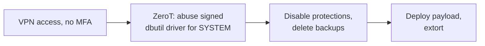

# The BYOVD operators

> Akira's affiliates needed SYSTEM, did not have a kernel researcher, and did not need one.
> They deployed ZeroT, a purpose-built elevation tool that abuses the signed Dell dbutil
> driver, CVE-2021-21551, the same driver this corpus dissects as a case study. This profile
> is the operator tier: crews for whom kernel access is a purchased commodity step in a
> rehearsed playbook, optimized for reliability on machines they do not care about.

!!! note "Verdict basis"
    `cited`, as of 2026-10-02, to Cisco Talos' Akira reporting (the ZeroT tool and the
    dbutil abuse), the FBI/CISA #StopRansomware: Akira advisory, and BleepingComputer's
    coverage of the Intel CPU-tuning driver abuse for disabling Defender. The operator-tier
    framing is this page's synthesis of those sources.

## Who

Not a developer: a tier. Ransomware crews and their affiliates, Akira the documented anchor,
running intrusion playbooks whose kernel step is BYOVD, Bring Your Own Vulnerable Driver:
drop a legitimately signed driver with a known vulnerability, load it, abuse it. The
[BYOVD reference](../reference/byovd.md) maps the technique; this profile maps the *customer*.

Akira's chain, per Talos and the CISA advisory: initial access through compromised VPN
accounts without MFA, then elevation via ZeroT, a custom tool exploiting the Dell `dbutil`
driver, [CVE-2021-21551](../case-studies/CVE-2021-21551.md), then the pre-encryption
preparation: disabling protections, deleting backups, staging the payload. Related
tradecraft in the same reporting family: abusing an Intel CPU-tuning driver to turn off
Microsoft Defender, and rebooting into safe mode to shed EDR coverage entirely.

## The signature: kernel access as a checklist item

Compare every other profile in this series. [Volodya](volodya-buggicorp.md) sells the bug.
The [CLFS contractor](clfs-contractor.md) writes it. [Candiru](candiru-sourgum.md) buys it
for a product. The operator *uses* it, once, as a step, on someone else's schedule. The
technical signature of the tier is what it optimizes for: not stealth after the fact, not
novelty, and definitely not elegance, but *success rate on unmanaged hardware at 3am*. That
is why the tool of choice is a years-old CVE in a driver that still loads.

## What it defeats, and what stops it

The operator tier is the clearest live demonstration of two defenses this corpus tracks.
First, the [vulnerable driver blocklist](../mitigations/driver-blocklist.md): dbutil and
its relatives are exactly what the list exists to stop, and the gap between Microsoft
shipping list entries and unmanaged machines receiving them is the gap the operators live
in, the same list-lag economics that page documents. Second,
[Driver Signature Enforcement](../mitigations/dse.md) is aimed past entirely: the driver is
signed, which is the point of BYOVD, so the load succeeds and nothing unsigned ever appears.

What actually constrains the tier is unglamorous: MFA on the VPN, the access layer where
these chains actually start, and blocklist enforcement that reaches consumer machines. Every
mitigation page in the corpus that ends "detection moves to the effect" was written for this
tier, because the operator is the one who produces the effects.

## Detection

The kernel step is the loudest, ironically. A known-vulnerable driver loading is a
near-zero-false-positive event on any fleet telemetry, and the sequence
drop-load-elevate-disable is a playbook signature rather than an anomaly. The quieter
steps are the access layer and the backup deletion, which is where the tier's operations
actually succeed or fail, and where the CISA advisory's mitigations concentrate.

## Assessment

The operators are why this site's Targets half has a customer base. They convert kernel
access directly into extortion revenue, on timelines measured in hours, with tools a decade
old, and they will use whatever loads. When the monthly MSRC triage surfaces a new
kernel-driver CVE, the practical question this profile frames is: how long until it shows
up in a staging folder next to a ransomware note, and which control on the
[matrix](../bypasses/index.md) decides whether that matters.

## Sources

Cisco Talos, "Akira ransomware continues to evolve" (2025): the ZeroT tool and dbutil
abuse; FBI/CISA et al., #StopRansomware: Akira Ransomware advisory (updated 2025);
BleepingComputer on the Intel CPU-tuning driver abuse; Huntress on the safe-mode
EDR-evasion chain.
