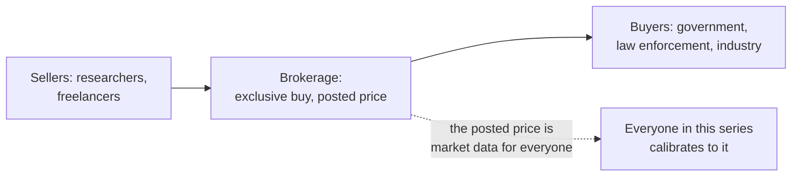

# Zerodium: the market maker

> Volodya advertised his first 0-day at $95,000 on a forum, guessing. Four years later, a
> brokerage posted a public price list, and nobody had to guess again. Zerodium did not
> write exploits or deploy them; it set their price, exclusively, in cash, and every tier of
> this series calibrated to it.

!!! note "Verdict basis"
    `cited`, as of 2026-10-03, to Zerodium's public program pages and price list coverage
    (Wired 2015, Krebs on Security 2016, The Hacker News 2019), and the VUPEN lineage
    documented therein. Client claims are the company's own statements.

## Who

The exploit brokerage founded in 2015 by Chaouki Bekrar of VUPEN, the French
vulnerability seller that pioneered the buy-exclusive-sell-to-governments model. Zerodium
is that model with a storefront: a public acquisition program, published prices, and a
client base it describes as major corporations, and government and law enforcement
agencies in North America and Europe.

## The signature: publish the price list

The public list is the artifact that matters, because a posted price is market data:

| Year | Windows 10 LPE 0-day | Context |
|---|---|---|
| 2015 | listed at launch | Full chart published (Wired) |
| 2016 | $90,000 | Krebs' "Got $90,000? A Windows 0-Day Could Be Yours" |
| 2019 | $200,000 | Raised schedule (The Hacker News) |
| later | pivots: $500,000 messaging, $1,000,000 Tor special | Demand moves |

Read as a time series, that list is a telescope pointed at demand. Windows desktop LPE
doubles in value over three years, solid, government-grade demand, then the headline
bounties migrate to mobile messaging and anonymity tooling, which is where the
[Candiru](candiru-sourgum.md)-tier product market was heading. The price list tells a
defender what the buyers are buying without ever seeing a buyer.

## What it defeats, and what stops it

Nothing technical, which is the point: the brokerage holds no exploits it did not buy and
runs no chains it did not purchase. What stops, or rather what disciplines this tier is
policy: export controls, disclosure laws like China's 2021 state vulnerability
repository rules, and the exposure economy that broke [Candiru](candiru-sourgum.md)'s
inventory open in 2021. A brokerage's real balance sheet risk is publicity, which is why
its responses to it are legal rather than technical.

## The honest counterweight

A posted price also has a defensive reading this corpus benefits from: every
[matrix](../bypasses/index.md) verdict that closes a technique family lowers the expected
value of the bugs that find them, and the broker's own migration away from desktop LPE
headliners is the market's confirmation that the Windows hardening curve, the one this
site's homepage draws, is real. The [sellers](volodya-buggicorp.md) moved because the
[funders](candiru-sourgum.md) moved, and both moved because the surface hardened.

## Assessment

Zerodium is the reference layer: the tier that converts everyone else's output into a
number. This series could not honestly claim to map the market without it, because a map
with no prices is a diagram, and the last decade of Windows exploitation economics is
legible in that one list moving from $90,000 to $200,000 to somewhere else entirely.

## Sources

Zerodium's program pages and public statements; Wired, "Here's a Spy Firm's Price List for
Secret Hacker Techniques" (2015); Krebs on Security, "Got $90,000? A Windows 0-Day Could Be
Yours" (2016); The Hacker News, "Zerodium Offers to Buy Zero-Day Exploits at Higher Prices"
(2019); ZDNet and SC Media on the later bounty pivots.
